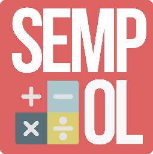

<p align="center" width="100%">
  
</p>

# Sempol - Semudah Itu Menghitung Pajak Kendaraan Bermotor Online - Data

Sempol application for calculate Indonesian vehicle tax and [live in here](https://sempol.theflavare.com/#/).

This repository is used to maintain the calculation data for Sempol App. Sempol App will take this data as data source, so all release changes in this repository will have directly effect on Sempol App.

You may ask, Where is Sempol App repository? Currently Sempol App is privately maintain by [@theflavare](https://theflavare.com/) and [Kantor Bersama Samsat Surabaya Barat]([https://theflavare.com/](https://www.instagram.com/samsatsbybarat)) (It may change to public in the future)

### What data are store here?
App will use [data.json](./data.json) that store:
- Vehicle Type List
- Vehicle Weight Price
- Calculation Formula
  - BBNKB / Bea Balik nama
  - Fiskal
  - STNK 5 Tahunan
  - Pajak Kendaraan Tahunan

### Schema

Each component have different purpose and schema

#### Vehicle Type List

This is available list for vehicle type to be calculate, it just list array of key-value then will be display on dropdown

```json5
  "vehicleTypes": [
    { "value": "SepedaMotor", "text": "Sepeda Motor" },
    { "value": "Sedan", "text": "Sedan" },
    //...
  ],
```

| field     | description                                               |
| --------- | --------------------------------------------------------- |
| **value** | Identify will be used for base weight key and calculation |
| **text**  | Display on dropdown                                       |

_\*Make sure to make it easy to read and maintain for future_

#### Base Weight / Vehicle Weight Price

List of constant key-value each vehicle type, can be fill for weight, base price, or any related with calculation. Current constant are used in formula.

```json5
  "baseWeights": {
    // format
    "vehicleType": {
      "Bobot": 0,
      "JR": 0,
      "BPKB": 0,
      "STNK": 0,
      "Plat": 0,
      "PNPBMutasi": 0,
      "DendaJR": 0
    },
    // sample
    "SepedaMotor": {
      "Bobot": 1,
      "JR": 35000,
      "BPKB": 225000,
      "STNK": 100000,
      "Plat": 60000,
      "PNPBMutasi": 150000,
      "DendaJR": 32000
    },
    //...
```

| field               | description                                        | Used in formula        |
| ------------------- | -------------------------------------------------- | ---------------------- |
| **key/vehicleType** | Identify from vehicle Type ID                      |                        |
| **Bobot**           | Base Weight calculation (used in some calculation) | All, Except fiskal     |
| **JR**              | Base price Jasa Raharja                            | All                    |
| **BPKB**            | Base flat price BPKB                               | bbnkb                  |
| **STNK**            | Base flat price STNK                               | bbnkb, stnkLimaTahunan |
| **Plat**            | Base flat price Plat                               | bbnkb, stnkLimaTahunan |
| **PNPBMutasi**      | Base flat price PNPB Mutasi                        | fiskal                 |
| **DendaJR**         | Base Fine price Jasa Raharja each day              | All                    |

_\*Can we change the variable or field name? **Yes but,** you should aware that this constant are also used in formula and also need to update._

#### Formula
Formula are used to calculate each subject. This formula based on publication from original sources. 

Formula calculation are using expression parser from [MathJS](https://mathjs.org/). You can check the docs there.

Each Subject will have same input (whenever it used or not) and need some assigned variable for output. All recognize assigned variable inside formula will be automatically exported.

Formula are run in ordered sequence.

Here available subject:
| subject               | description                      |
|-----------------------|----------------------------------|
| bbnkb                 | Bea Balik Nama                   |
| fiskal                | Fiskal                           |
| stnkLimaTahunan       | Perpanjang STNK 5 Tahun          |
| pajakKendaraanTahunan | Pajak Kendaraan Bermotor Tahunan |

Here available variable:
| variable              | in/out | data type | description                                                           | used in |
|-----------------------|--------|-----------|-----------------------------------------------------------------------|---------|
| masukanPajak          | in     | Number    | Input Masukan Pajak                                                   | All     |
| telatDay              | in     | Number    | Late duration from Input "Masa Laku Pajak" and current time (in days) | All     |
| baseWeight            | in     | Object    | baseWeight object from data, already filtered with vehicle type       | All     |
| njkb                  | out    | Number    | NJKB                                                                  | bbnkb, stnkLimatTahunan, pajakKendaraanTahunan     |
| dasarPengenaanPajak   | out    | Number    | Dasar Pengenaan                                                       | bbnkb, stnkLimatTahunan, pajakKendaraanTahunan     |
| bbn                   | out    | Number    | Bea Balik Nama                                                        | bbnkb     |
| pajak                 | out    | Number    | Pajak                                                                 | bbnkb, stnkLimatTahunan, pajakKendaraanTahunan     |
| jasaRaharja           | out    | Number    | Jasa Raharja                                                          | bbnkb, stnkLimatTahunan, pajakKendaraanTahunan     |
| kekuranganPajak       | out    | Number    | Kekurangan Pajak                                                      | All     |
| finalDendaJR          | out    | Number    | Denda Jasa Raharja                                                    | All     |
| bpkb                  | out    | Number    | BPKB                                                                  | bbnkb     |
| stnk                  | out    | Number    | STNK                                                                  | bbnkb, stnkLimatTahunan     |
| platNomor             | out    | Number    | Plat Nomor                                                            | bbnkb, stnkLimatTahunan     |
| PNPBMutasi            | out    | Number    | PNPB Mutasi Keluar                                                    | fiskal  |
| total                 | out    | Number    | Total                                                                 | All     |

#### *Can we use other temporary variable for calculation? 
Yes, you can see to calculate "Denda Jasa Raharja" need some other calculation.
```json5
      "kekuranganPajak = (pajak / 12) * (dendaDuration + 1)", // 5
      "dendaJR = baseWeight.DendaJR * dendaJasaRaharjaDuration",  // 6
      "finalDendaJR = jasaRaharja * dendaJasaRaharjaDuration + dendaJR",  // 7
```
as you can see, **kekuranganPajak** is not used for input/output, so you can use it to assign as local variable. This only have scope in this calculation and next sequence (6, 7, ...)

#### *Can we change input/output variable name?
No you can't. 

#### *Can we leave required output variable unassigned?
Currently, No you can't. (We still working to make more efficient)

#### Unit Test?
Please update the Unit Test if you have any changes in calculation

### New Subject to Calculate?

Currently, new calculate can be only requested here as an issue.

### How to Contribute?

We appreciate your help! You can contribute as long as the data update is valid.

- You can start to pull a new request to branch 'dev' and explain what data changes.
- Request review and...
- Admin will check and consolidate with other data changes into one and release them

### Contributor

[@theflavare](https://theflavare.com/)
[@Raditzlawliet](https://github.com/raditzlawliet)
